# **Adaptive Traffic Control with AI - Real-time Object Detection with YOLO** 
YOLO (You Only Look Once) is a Deep Convolutional Neural Network that performs object detection from images.

It solves two problems - 
1. A Classification problem - to identify the type of object (e.g. car, person, auto, traffic lights, etc.) - Predicts class labels with a confidence score.
2. A Regression problem - it localizes the detected object with a bounding box in the image (e.g. finds the location of the object in the entire image). - Predicts the location of the bounding box - (x,y) coordinate of the centre of the bounding box along with the width and height of the bounding box.


# Create a Custom Dataset
1. Collect new images (car, auto, bus, traffic lights, person, etc.)
2. Annotate images using a tool like **Label Studio**.
3. Save your annotated data in a zip file `YOLO_Data.zip`

# Model Training [`YOLO_Train.ipynb`]
4. Download a pre-trained YOLO model (e.g. Yolov11) from **Ultralytics**. Check **Quick Start** Step 3.
5. Train the YOLO model on **Google Colab** with GPU (Graphics Processing Unit, T4 GPU). Check **Quick Start** Step 4.
6. Save and download the newly trained YOLO model (e.g., **yolo11n.pt**). Check **Quick Start** Step 4.

# Deployment
7. Download the model on Raspberry-Pi-5.
8. Convert the .pt model to NCNN format (optimized for the ARM CPUs like the one Raspberry-Pi has). Check **Quick Start** Step 5.
9. Run the optimized model on the Raspberry-Pi. Check **Quick Start** Step 6.


---
## 🗂️ Project Structure

```
YOLO/
├── requirements.txt            # Required Python libraries/packages to be installed.
├── camera_capture.py           # Script to capture image/video for model training. REquired during data collection.
├── YOLO_Train.ipynb            # IPython notebook to train the YOLO model. This will be run on a Google Colab environment having GPU accesss (e.g. T4 GPU).
├── yolo11n.pt                  # Trained YOLO model in pytorch format PyTorch format (.pt).
├── my_model.zip                # Trained model with all artifacts.
├── pt2ncnn.py                  # Convert a .pt YOLO model to the NCNN format. NCNN format is suitable for ARM processsors (as found in a Raspberry-Pi board).
├── yolo_detect.py              # Main script to run the YOLO object detection application.
├── ReadMe.md                   # Project Description.

```

---

## 🚀 Quickstart

### Run the following commands in the root project folder.

### 1. Create a Virtual Environment [On the Raspberry-Pi][Setup]

```bash
python -m venv yolo
```

### 2. Activate the Virtual Environment

```bash
# On your Laptop (Windows)
yolo/Scripts/activate
```
```bash
# On your Raspberry-Pi (running Raspberry Pi OS) [On the Raspberry-Pi]
source yolo/bin/activate
```
### 3. Install Requirements
After the virtual environment has been activated, you need to install the necessary libraries.

```bash
pip install -r requirements.txt
```
### 4. Train the YOLO model
Runs on the Google Colab platform.
i. Check the IPython notebook, `YOLO_Train.ipynb`. This file is self contained.  
ii. Upload your curated data filre `YOLO_Data.zip`. 
iii. Run all the cells sequentially. 
iv. After training is completed, a `yolov11.pt` file is created. Download this file and store it in the root project folder of the Raspberry-Pi board.

### 5. Convert the YOLO model from .pt to NCNN Format [On the Raspberry-Pi]
You need to convert the `yolov11.pt` to `yolov11_ncnn_model` 
```bash
python pt2ncnn.py
```

### 6. Run The Application (Object detection with YOLO on realtime video) [On the Raspberry-Pi]
```bash
python yolo_detect.py
```

## Note: 
Steps 1, 2, 3, 5, 6 are to be run either on a Laptop or a Raspberry-Pi board.

Step 1, 2, 3 are required to setup the environment and do the installations.

Step 5, 6 are required to run the application.

Step 4 is to be run on a Google Colab (or similar environment having a GPU access).

---

---
## 🖼 Data Creation/Annotation in Label Studio [Screenshot]


---
## Organizing Data 
## Unzip the YOLO_Data.zip file in `custom_data` directory.
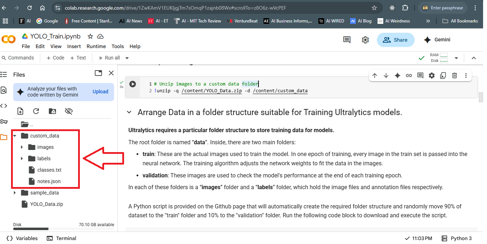

## Organize data in `data` directory having two separate subfolders named `train` and `validation`.
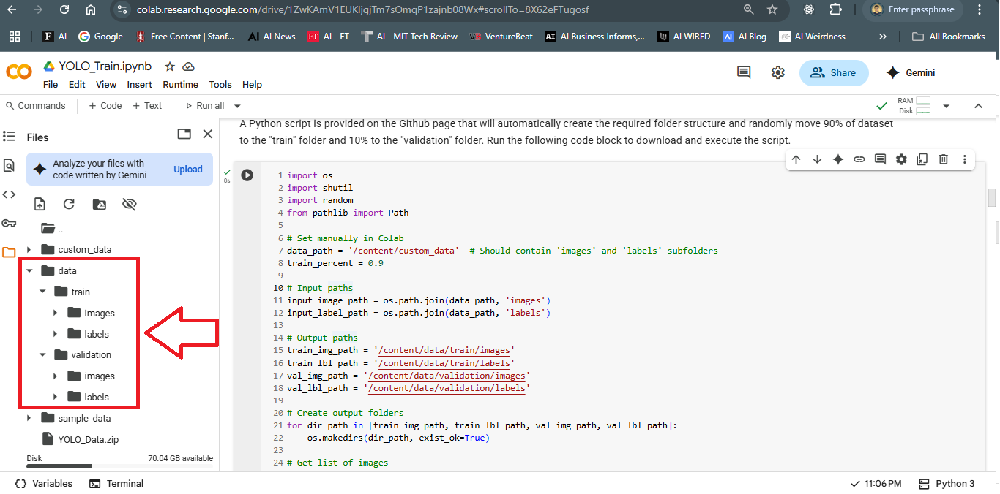

## Create `data.yaml` file.
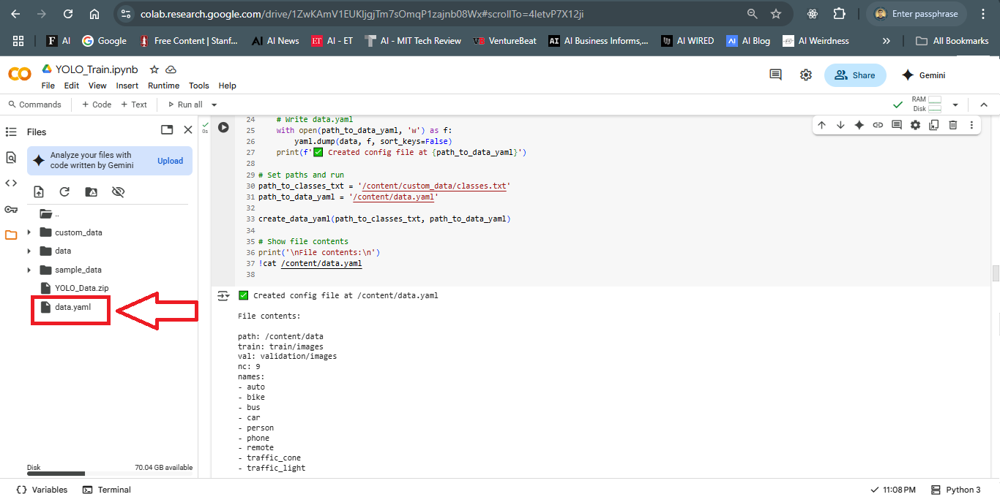

---
## Installations
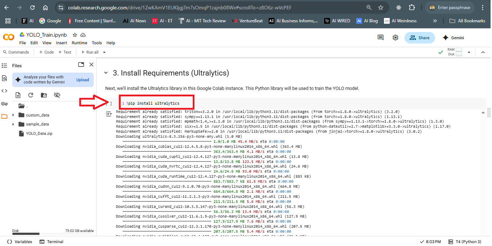

---
## Model Architecture
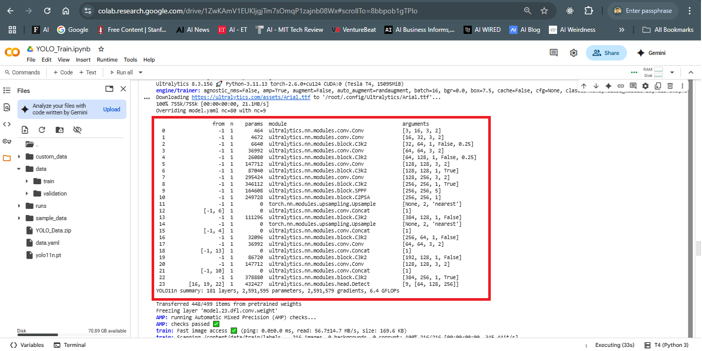

---
## Model Training
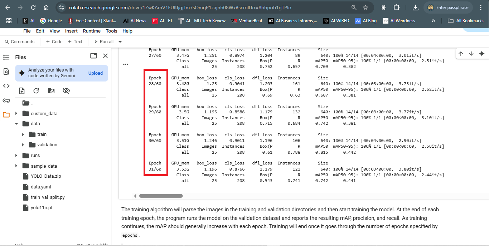

---
## 📊 Sample Metrics
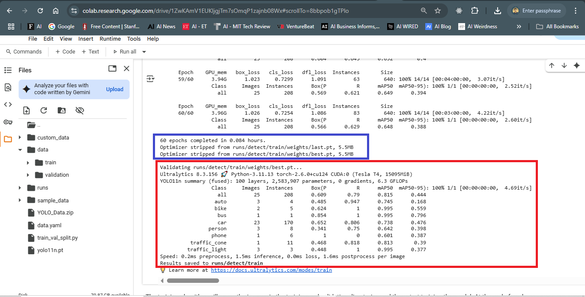

## Training/Validation Loss/Accuracy/mAP/Precision/Recall
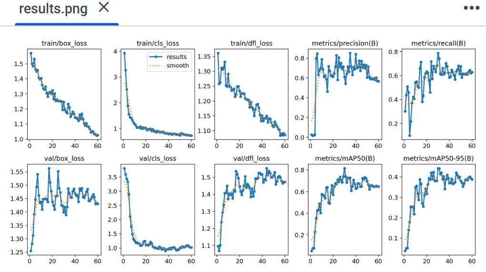

---
## Save the Trained Model
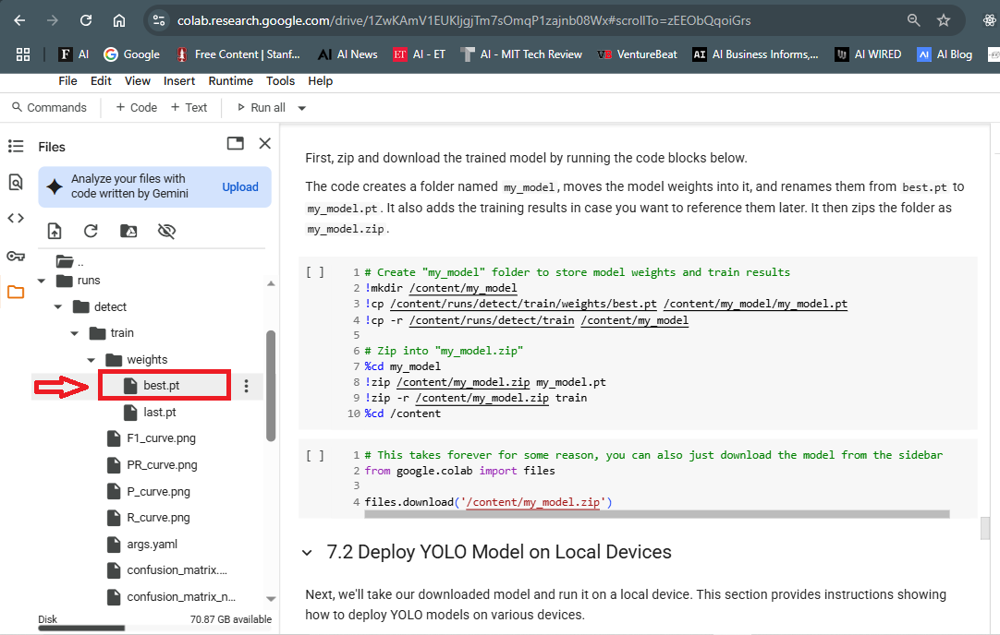

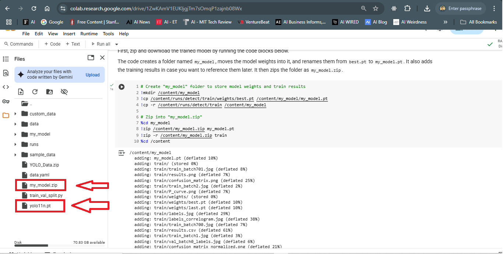
---

## Test the Model
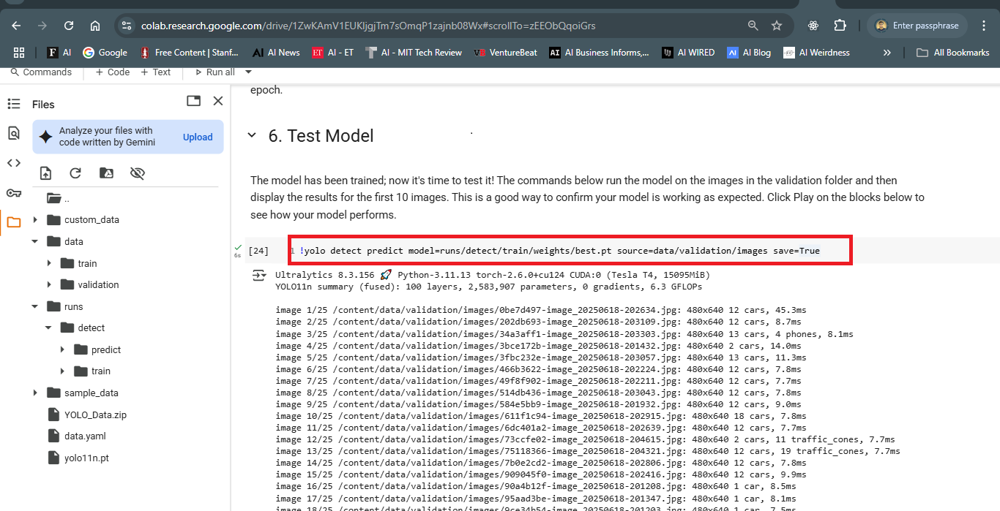

## Model Inference Results
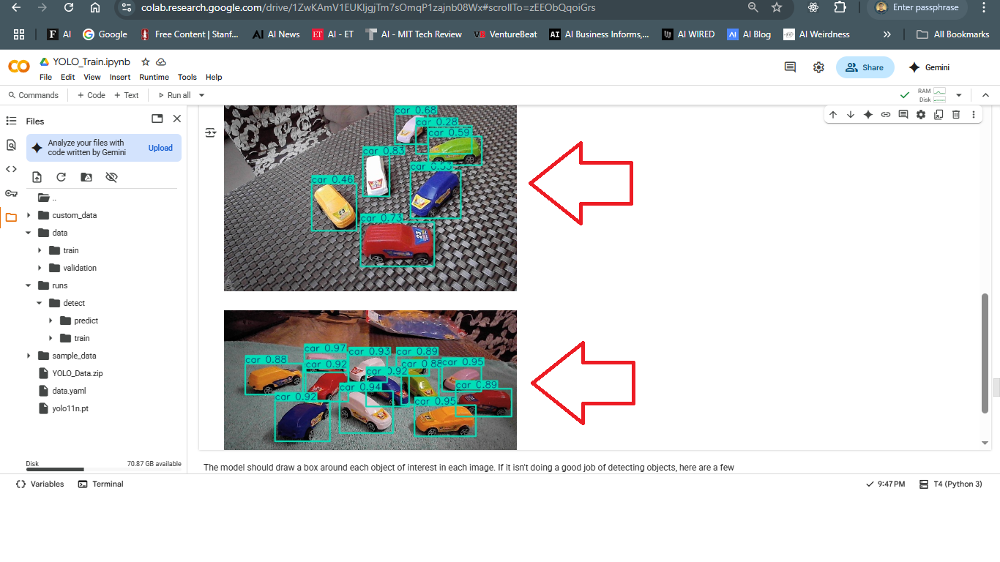
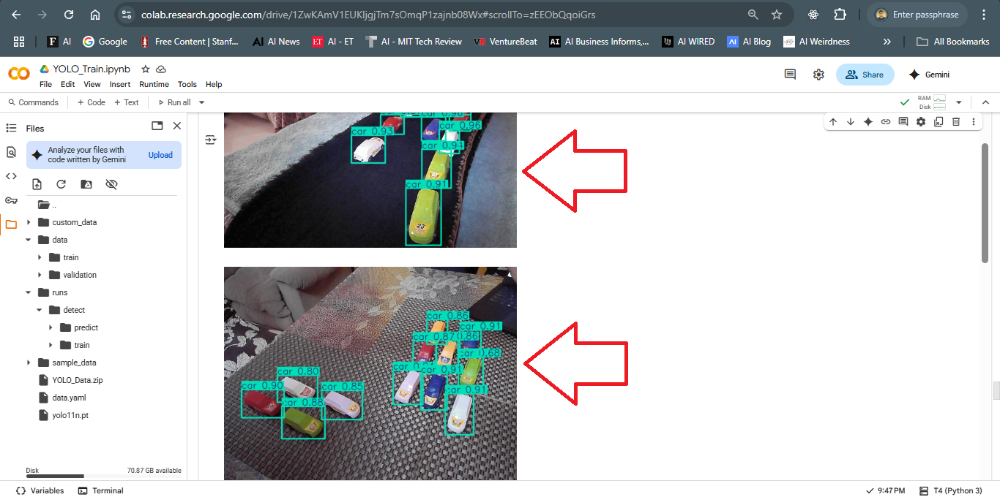


---
## 📄 License
This project is open-sourced under the [MIT License](LICENSE).
---

## 🧠 Author
Ms. Samriddha Shaikh  
Student, Class-10, Amity International School, Sector-46, Gurgaon

---
## 📬 Contact
For questions or suggestions, reach out to me at samriddha.shaikh@gmail.com 
---

 
 
