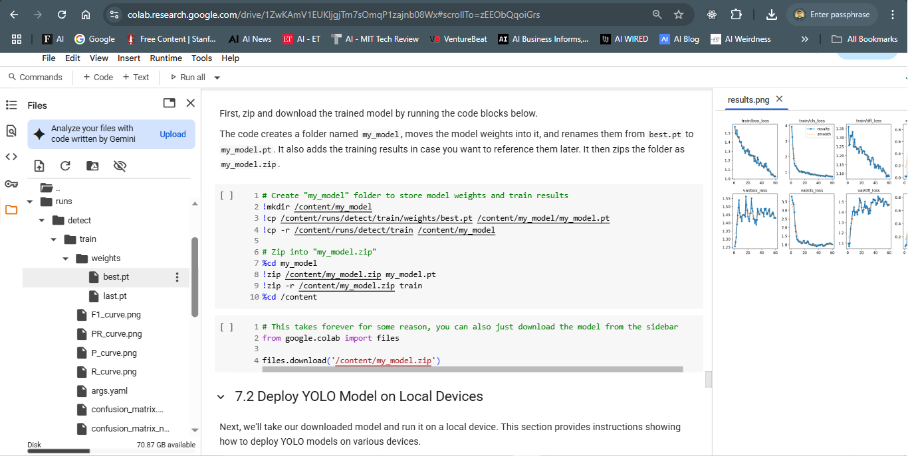

# YOLO

# Object Detection with YOLO 
YOLO (You Only Look Once) is a Deep Convolutional Neural Network that performs object detection from images.

It solves two problems - 
1. A Classification problem - to idenfify the type of object (e.g. car, person, auto, traffic lights, etc.) - Preditcs class labels with a confidence score.
2. A Regression problem - it localizes the detected object with a bounding box in the image (e.g. finds the location of the object in the entire image). - Predicts the location of the bounding box - (x,y) coordinate of the centre of the bounding box along with the width and height of the bounding box.


# Create a Custom Dataset
1. Collect new images (car, auto, bus, traffic lights, person, etc.)
2. Annotate images using a tool like Label Studio.

# Model Training
3. Download a pre-trained YOLO model (e.g. Yolov11) from Ultralytics.
4. Train the Yolo model on Google Colab wuth GPU (Graphics Processing Unit, T4 GPU)
5. Save and download the newly trained Yolo model.

# Deployment
6. Download the model on Raspberry-Pi-5.
7. Convert the .pt model to NCNN format (optimized for the ARM CPUs like the one Raspberry-Pi has).
8. Run the optimized model on the Raspberry-Pi.


---
## 🗂️ Project Structure

```
YOLO/
├── camera_capture.py           # Script to capture image/video for model training.
├── pt2ncnn.py                  # Convert a .pt YOLO model to the NCNN format.
├── train_val_split.py          # Sctipt to split the data into training and validation sets.
├── yolo_detect.py              # Main script to run the YOLO obhect detection application
├── yolo11n.pt                  # Trained Yolo model in pytorch format (.pt).
├── my_model.zip                # Trained model with all artifacts.
├── requirements.txt            # Required Python packages
├── ReadMe.md                   # Project Description.

```

---
## 🖼 Data Creation Screenshot


---

## 📊 Sample Metrics



## Save the Trained Model


---
## 📄 License
This project is open-sourced under the [MIT License](LICENSE).
---

## 🧠 Author
Ms. Samriddha Shaikh  
Student, Class-10, Amity International School, Sector-46, Gurgaon

---
## 📬 Contact
For questions or suggestions, reach out to me at samriddha.shaikh@gmail.com 
---

 
 
